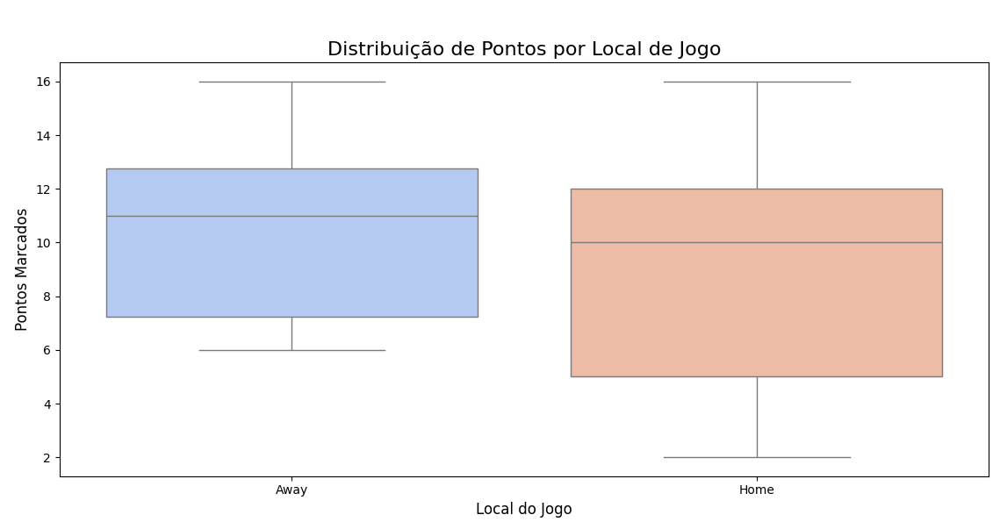
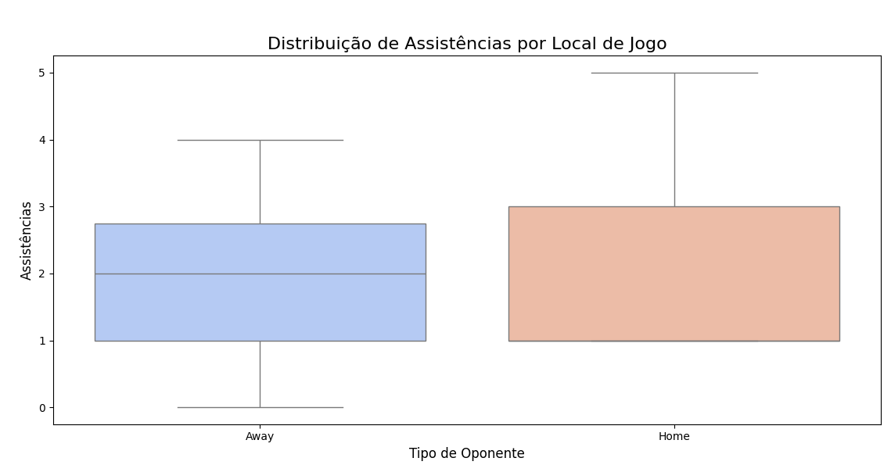

# NBA Forecaster 🏀📊

Este é um projeto de estudos focado no aprendizado prático de processamento de dados, probabilidade e análise estatística utilizando Python. Utilizando dados reais da NBA (focando no desempenho do Shai Gilgeous-Alexander no 1º Quarto/Q1), o objetivo principal deste repositório é aplicar conceitos teóricos de programação e matemática na prática.

Para este exercício, os dados brutos foram coletados do site **StatMuse**, inseridos no script para processamento e estruturação, e exportados para um arquivo `.csv`. A partir dessa base, o código explora o cálculo de métricas estatísticas, probabilidades preditivas e a geração de visualizações gráficas de desempenho (Casa vs. Fora).

## 🧠 O que eu aprendi / Etapas de Análise de Dados

Este projeto foi desenvolvido com foco no aprendizado prático e me permitiu passar por todas as etapas fundamentais de um projeto real de **Análise de Dados**:

1. **Coleta e Limpeza de Dados (Data Wrangling / ETL):** Aprendi a lidar com dados do mundo real, que raramente vêm prontos. Peguei dados brutos e desestruturados (texto copiado da web) e criei uma lógica em Python para limpá-los, interpretando informações (como transformar "@" e "vs" em "Away" e "Home") e estruturando tudo em um arquivo `.csv` organizado.
2. **Manipulação de Dados:** Pratiquei o uso da biblioteca `pandas` para carregar o arquivo estruturado, isolar as colunas de interesse e criar DataFrames específicos (`df_pontos` e `df_assistencias`) para alimentar os cálculos matemáticos.
3. **Análise Estatística (Estatística Inferencial):** Fui além das métricas descritivas básicas (como calcular apenas a média). Utilizei a biblioteca `scipy` para aplicar estatística avançada, calculando **Intervalos de Confiança** e utilizando a **Distribuição Normal** e a **Distribuição T de Student** para prever probabilidades matemáticas de desempenho futuro.
4. **Visualização de Dados (DataViz):** Aprendi a traduzir números em insights visuais utilizando `seaborn` e `matplotlib`. Gerei gráficos técnicos (Boxplots) que facilitam a análise da dispersão dos dados e a identificação visual de padrões de comportamento do jogador dependendo do local do jogo.

## 🚀 Funcionalidades

* **ETL (Extração, Transformação e Carga):** Converte dados brutos de texto em um formato tabular organizado, gerando o arquivo `nba_shai_1q_stats.csv`.
* **Análise Estatística:** Calcula a média, desvio padrão e probabilidades preditivas para Pontos e Assistências usando distribuições estatísticas.
* **Visualização de Dados:** Gera gráficos de Boxplot comparando o desempenho do jogador em jogos em Casa (Home) versus jogos Fora (Away).

### Visualização de Dados (Q1 - 1º Quarto)

Abaixo estão as distribuições de Pontos e Assistências do Shai Gilgeous-Alexander focadas especificamente no primeiro quarto (Q1) dos jogos:





## 📈 Exemplo de Saída (Output do Terminal)

Ao executar o script, o sistema calcula as estatísticas em tempo real e exibe as previsões no terminal. Abaixo está um exemplo real da análise gerada para o jogador:

```text
Pontos:
[12, 13, 8, 11, 14, 7, 10, 11, 9, 6, 2, 10, 13, 4, 16, 16, 13, 6, 6, 6, 12, 12, 4, 7, 13]
PDF da distribuição normal em x = 10: 0.1050
Probabilidade da distribuição amostral de pontuar menos que 10 pontos (Normal): 0.54
Probabilidade de distribuição amostral de pontuar mais que 10 pontos (Normal): 0.46
Valor T de Student: 0.10
Probabilidade de marcar menos de 10 pontos (T de Student): 0.54
Probabilidade de marcar mais de 10 pontos (T de Student): 0.46
Intervalo de Confiança (95%): (8.05, 11.23)

Assitencias:
[1, 0, 2, 2, 1, 5, 1, 4, 4, 2, 1, 1, 3, 1, 1, 4, 2, 4, 1, 2, 1, 4, 1, 1, 1]
PDF da distribuição normal em x = 2: 0.2941
Probabilidade da distribuição amostral de marcar menos que 2 assistencia: 0.50
Probabilidade de distribuição amostral de marcar mais que 2 assistencias: 0.50
Valor T de Student: 0.00
Probabilidade de marcar menos de 2 assistencias (T de Student): 0.50
Probabilidade de marcar mais de 2 assistencias (T de Student): 0.50
Intervalo de Confiança (95%): (1.43, 2.57)

Pontos em Casa
[11, 14, 7, 10, 11, 2, 4, 16, 6, 4, 13]
PDF da distribuição normal em x = 10: 0.0883
Probabilidade da distribuição amostral de pontuar em casa menos que 10 pontos (Normal): 0.60
Probabilidade de distribuição amostral de pontuar em casa mais que 10 pontos (Normal): 0.40
Valor T de Student: 0.25
Probabilidade de marcar em casa menos de 10 pontos (T de Student): 0.60
Probabilidade de marcar em casa mais de 10 pontos (T de Student): 0.40
Intervalo de Confiança (95%): (5.82, 11.99)
```

## 🧮 Estatísticas e Matemática Aplicada

O script utiliza a biblioteca `scipy.stats` para calcular a probabilidade de eventos futuros (ex: chance de marcar mais de 10 pontos) com base nas seguintes métricas:

* **Distribuição Normal:** Calcula a Função de Densidade de Probabilidade (PDF) e a probabilidade acumulada (CDF).
* **Distribuição T de Student:** Ideal para amostras menores, ajustando a probabilidade através da fórmula do T-score: 
$$t=\frac{x-\bar{x}}{s}$$
* **Intervalo de Confiança:** Estima com 95% de confiança a margem de atuação do jogador, utilizando a fórmula:
$$\bar{x}\pm t\cdot\frac{s}{\sqrt{n}}$$

## 🛠️ Tecnologias e Bibliotecas

O projeto foi desenvolvido em Python e requer as seguintes bibliotecas:
* `pandas` (Manipulação do CSV e DataFrames)
* `numpy` (Cálculos numéricos base)
* `scipy` (Funções estatísticas)
* `matplotlib` & `seaborn` (Criação dos gráficos e visualizações)

## ⚙️ Como Executar o Projeto

**1. Clone o repositório:**
```bash
git clone [https://github.com/SEU_USUARIO/NBA_Forecaster.git](https://github.com/Ruan-h/NBA_Forecaster.git)
cd NBA_Forecaster
```

**2. Crie e ative o ambiente virtual:**
```bash
python3 -m venv venv
source venv/bin/activate
```

**3. Instale as dependências:**
```bash
pip install -r requirements.txt
```

**4. Execute o script principal:**
```bash
python main.py
```
